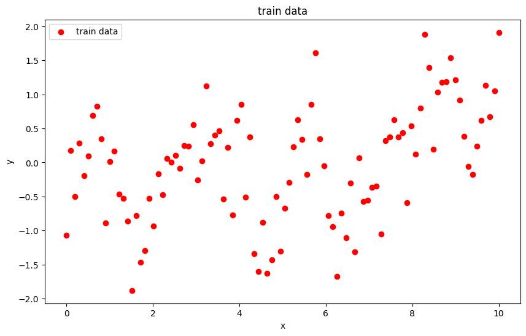
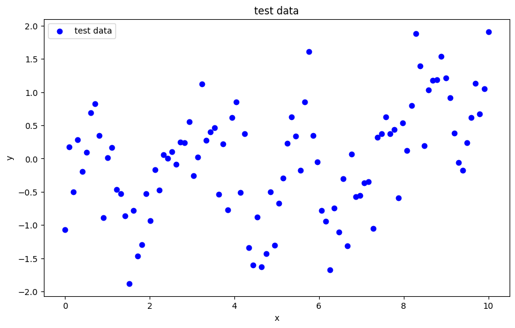
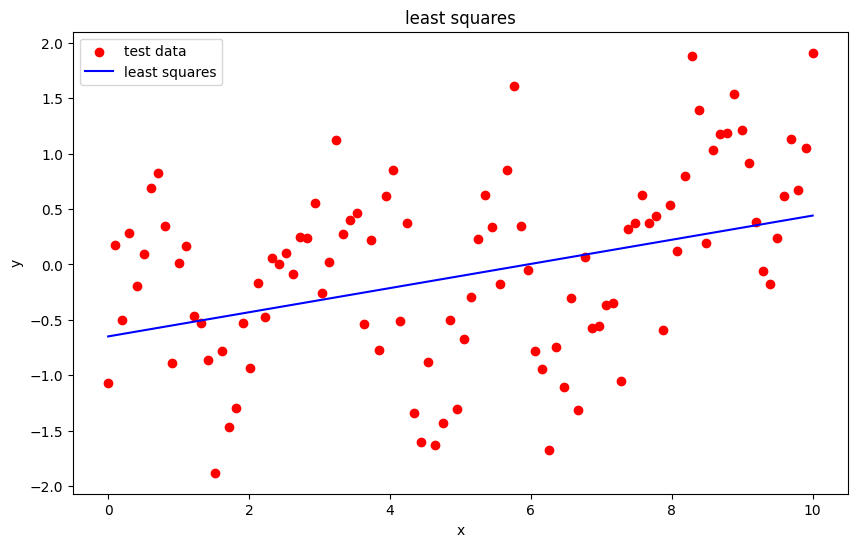
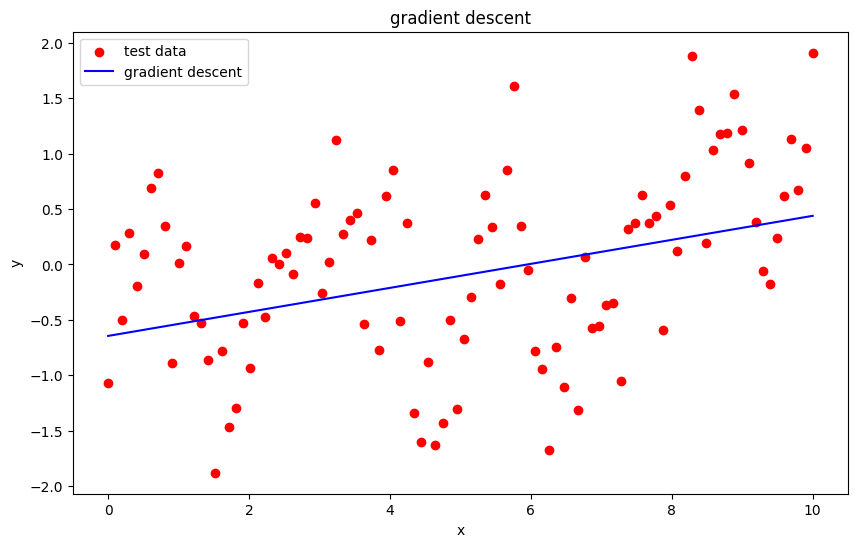
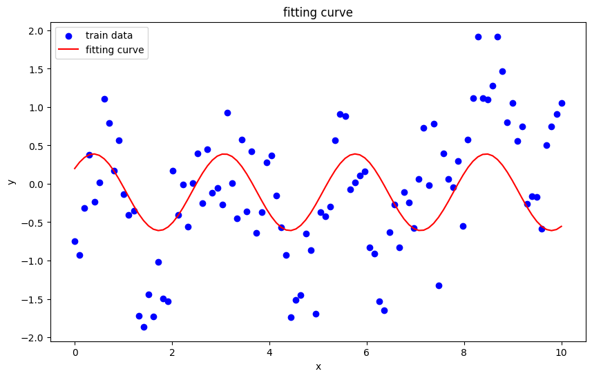
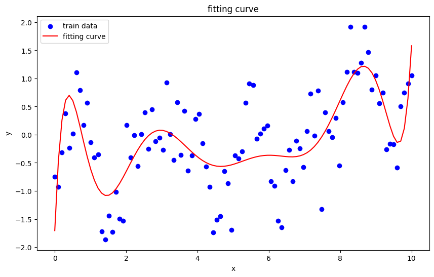

# 数据拟合作业报告

秦超 22373405@buaa.edu.cn

## 摘要

此报告为PRML第一次作业，旨在完成对所给数据的拟合和分析。

## 引入

在科学研究和数据分析中，数据拟合是探索数据规律、建立模型的关键步骤。它不仅帮助我们理解复杂现象背后的数学关系，还能为预测和决策提供有力支持。本次作业将通过数据拟合，深入挖掘数据特征，构建精准模型，旨在提升对数据驱动方法的理解与应用能力。

## 研究方法

此次作业使用三种方法对所给数据进行线性拟合，以及两种不同的非线性函数模型进行拟合。

### 最小二乘法

最小二乘法是一种数学优化技术，它通过最小化误差的平方和来寻找一组数据的最佳函数匹配。对于线性函数$y = ax + b$的拟合，最小二乘法的目标是最小化误差平方和：

$$
E(a, b) = \sum_{i=1}^{n} (y_{i} - (a x_{i} + b))^{2}
$$

通过求解 $E(a,b)$ 关于 $a$ 和 $b$ 的偏导数，并令其为零，可以得到$a $和$ b $的解析解：

$$
a = \frac{n \sum x_{i} y_{i} - \sum x_{i} \sum y_{i}}{n \sum x_{i}^{2} - (\sum x_{i})^{2}}, \quad b = \frac{\sum y_{i} - a \sum x_{i}}{n}
$$

### 梯度下降法

梯度下降法是一种迭代的优化算法，用于求解函数的最小值。对于线性函数 $y=ax+b$ 的拟合，梯度下降法的目标是最小化误差平方和 $E(a,b)$。梯度下降法的迭代公式是：

$$
a_{k+1} = a_{k} - \eta \frac{\partial E}{\partial a}, \quad b_{k+1} = b_{k} - \eta \frac{\partial E}{\partial b}
$$

其中 $η$ *是学习率，*$\frac{\partial E}{\partial a}$ 和 $\frac{\partial E}{\partial b}$ 分别是 $E(a,b)$ 关于 $a$ 和 $b$ 的偏导数。

### 牛顿法

牛顿法是一种求解函数极值的迭代方法，它利用函数的一阶和二阶导数来逼近极值点。对于线性函数 $y=ax+b$ 的拟合，牛顿法的目标是最小化误差平方和 $E(a,b)$。牛顿法的迭代公式是：

$$
\begin{align*}
\left[\begin{matrix}
a_{k+1} \\
b_{k+1}
\end{matrix}\right] = 
\left[\begin{matrix}
a_k \\
b_k
\end{matrix}\right] - 
\mathbf{H}^{-1}(\mathbf{x}_k) \nabla E(\mathbf{x}_k)
\end{align*}
$$

其中 $\mathbf{H}^{-1}(\mathbf{x}_k)$ 是 $E(a,b)$ 的海森矩阵的逆矩阵，$\nabla E(\mathbf{x}_k)$ 是 $E(a,b)$ 的梯度。

### 非线性拟合

非线性拟合是指使用非线性模型来拟合数据的过程。与线性拟合不同，非线性拟合中的模型参数与自变量之间的关系是非线性的。非线性拟合通常用于描述复杂的数据关系。

## 实验内容

对所给的一组二维数据（分为训练数据和测试数据），使用最小二乘法、梯度下降法和牛顿法三种方法分别进行线性拟合，并计算训练误差和测试误差。之后，使用两种非线性函数模型对所给数据进行拟合。

下给出训练数据和测试数据的散点图：

## 实验数据

### 线性拟合

根据三种不同的拟合方法，得到的拟合线性函数 $y = ax + b$ 的参数如下：

|       | 最小二乘法          | 梯度下降法          | 牛顿法              |
| ----- | ------------------- | ------------------- | ------------------- |
| $a$ | 0.1089473868580371  | 0.10827265618339714 | 0.10894738685803708 |
| $b$ | -0.6487466967301857 | -0.6442592675352024 | -0.6487466967301854 |

误差计算使用均方误差，计算公式为：

$$
\begin{align*}
\mathrm{MSE} = \frac{1}{n} \sum_{i=1}^n (y_i - \hat{y}_i)^2
\end{align*}
$$

三种线性拟合的误差计算如下表：

|                    | 最小二乘法         | 梯度下降法         | 牛顿法             |
| ------------------ | ------------------ | ------------------ | ------------------ |
| **训练误差** | 0.6134024281450051 | 0.6134075391306283 | 0.6134024281450051 |
| **测试误差** | 0.593273429404795  | 0.5930801995104871 | 0.5932734294047949 |

下给出三种线性拟合的函数图像：

最小二乘法：

梯度下降法：

牛顿法：

### 非线性拟合

由于从图像中观察到一定的周期性，考虑到出现波峰波谷以及多次穿过$x$轴，现考虑使用两种非线性模型进行拟合：（1）正弦型函数（2）高次多项式型函数。

#### 正弦型函数

拟合函数模型为 $y = a \sin(bx + c) + d$，使用python中的lmfit库进行非线性函数拟合。

首先确定模型初始参数，振幅 $ a $ 可以通过数据的最大值和最小值的差的一半来估计，偏移量 $d$ 可以通过数据的平均值来估计，角频率 $b$ 通过估计数据的周期性或进行快速傅里叶变换求得，相位 $c$ 初始设为 0 。

实验结果如下表：

|                  |           $a$           |           $b$           |           $c$           |           $d$           |
| :--------------: | :-----------------------: | :-----------------------: | :-----------------------: | :------------------------: |
| **初始值** |         1.891195         |         2.488141         |             0             |         -0.1040098         |
| **最终值** | 0.49968014 +/- 0.10888744 | 2.33694160 +/- 0.08060947 | 0.66665082 +/- 0.44646512 | -0.11027065 +/- 0.07837673 |

计算误差得：

| 训练误差           | 0.5846680250226861 |
| ------------------ | ------------------ |
| **计算误差** | 0.5851237799921417 |

正弦型函数拟合图像为：

#### 高次多项式函数

拟合函数模型为 $y = \sum_{i=0}^n a_i x^i \, $，根据观察确定最高次项次数为 $n=9$ 。

使用10个随机数随机初始化参数（保证最高次项系数不为0）。

实验结果如下：

|         | 参数值                     |
| ------- | -------------------------- |
| $a_0$ | -1.70592428 +/- 0.49967938 |
| $a_1$ | 15.3019246 +/- 3.01806072  |
| $a_2$ | -32.9413226 +/- 5.85752672 |
| $a_3$ | 29.1502638 +/- 5.12406487  |
| $a_4$ | -13.4947866 +/- 2.40460838 |
| $a_5$ | 3.62130812 +/- 0.65773324  |
| $a_6$ | -0.58437270 +/- 0.10806182 |
| $a_7$ | 0.05593193 +/- 0.01049688  |
| $a_8$ | -0.00292459 +/- 5.5520e-04 |
| $a_9$ | 6.4324e-05 +/- 1.2319e-05  |

计算误差如下：

| 训练误差           | 0.3541092055662051  |
| ------------------ | ------------------- |
| **测试误差** | 0.38168644470810575 |

高次多项式函数拟合图像为：

## 分析与结论

在线性拟合实验中，三种拟合方法所得的结果相差不大，但是由于训练数据表现出明显的非线性，导致线性拟合效果不佳，由误差和拟合图像明显可得。

在非线性拟合实验中，正弦型函数确实很好的描述了其表现出的某种周期性，但是由计算误差和拟合图像明显可知，此次正弦型函数的拟合效果不佳，其计算误差甚至与线性拟合相当。可能是由初始参数的设定有关，有待之后实验改进。

高次多项式函数则表现出更好的拟合效果，无论是最低的计算误差还是较为贴合的函数图像都表示这一点，但是相对误差达到30%左右，还有待优化的空间。
