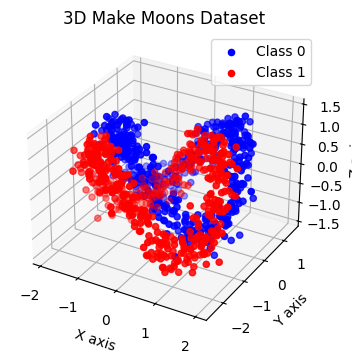
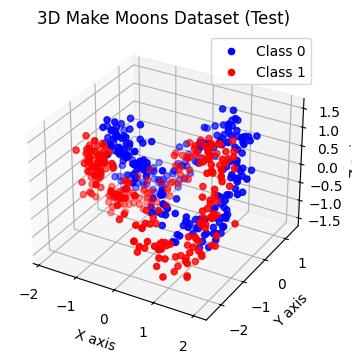
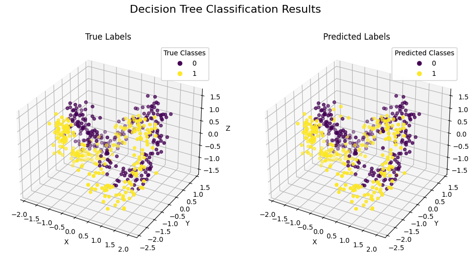
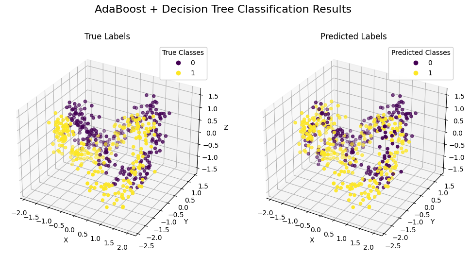
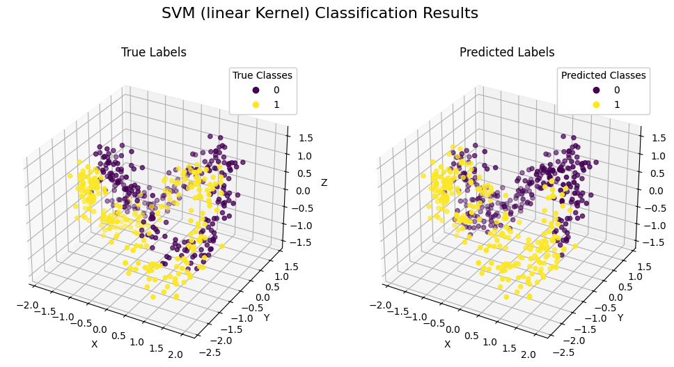
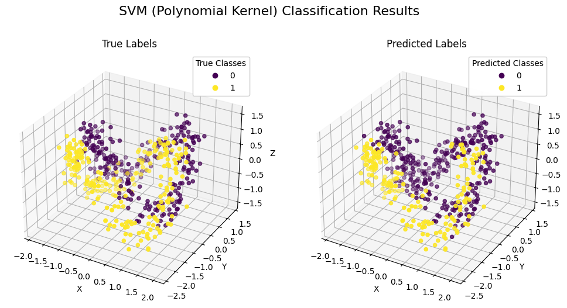
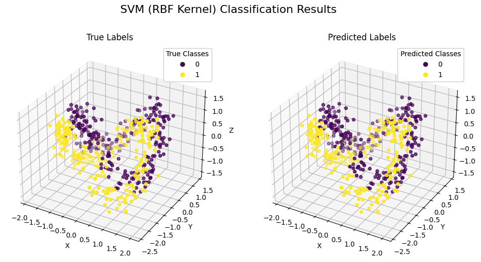

# 数据分类作业报告

秦超 22373405

## 摘要

此为PRML第二次作业，旨在用Decision Trees, AdaBoost + DecisionTrees, 与SVM三个不同的分类器对所给数据进行分类训练与测试，同时比较其性能并分析原因。

## 研究方法

此次实验使用Decision Trees, AdaBoost + DecisionTrees, 与SVM三个不同的分类器对数据集进行分类训练。

### 决策树（Decision Trees）

决策树是一种直观的机器学习算法，用于分类和回归任务。它通过学习简单的决策规则从特征到目标变量来预测数据。决策树的每个内部节点表示一个特征上的属性测试，每个分支代表测试结果，每个叶节点代表一个类别或回归值。

### AdaBoost + 决策树（AdaBoost + DecisionTrees）

AdaBoost（自适应增强）是一种集成学习算法，通过组合多个弱分类器（如决策树）来构建一个强分类器。AdaBoost算法的核心思想是，通过调整每个弱分类器的权重，使得最终的强分类器在所有弱分类器上都有良好的性能。

### 支持向量机（SVM）

支持向量机是一种强大的机器学习算法，主要用于分类任务，也可以用于回归（称为支持向量回归）。SVM的目标是找到一个最优的超平面，使得不同类别的数据点之间的间隔最大化，从而实现最佳的分类效果。

## 实验内容

使用程序生成一个3D双月数据集。一共有1000个数据，被分成了两大类：C0与C1。 利用该数据做训练，同时利用程序新生成与训练数据同分布的500个数据（250个为C0类，250个数据为C1类）来做测试。

下面给出一次实验中程序生成的训练数据和测试数据图：

## 实验数据

下表为不同分类器训练后对所给测试数据的准确率：

| 分类器                       | 准确率 |
| ---------------------------- | ------ |
| **Decision Tree**           | 0.9520 |
| **AdaBoost+ Decision Tree** | 0.7280 |
| **SVM (linear)**            | 0.6760 |
| **SVM (poly)**              | 0.8560 |
| **SVM (rbf)**               | 0.9660 |

下面给出在不同分类器下的预测结果输出：

## 分析与结论

由训练准确率可看出，对所给的三维双月数据集，RBF核的SVM测试效果最好，决策树其次，Poly核的SVM适中，而Adaboost+决策树与linear核的SVM测试效果差。

对于**决策树（Decision Tree）**，决策树能够很好地捕捉数据中的非线性关系和复杂结构。双月数据集虽然复杂，但决策树可以通过分裂节点逐步划分数据，形成较为准确的决策边界。决策树在这种数据集上没有过拟合，可能是因为数据的分布相对清晰，且噪声水平适中。

对于**Adaboost+决策树**，AdaBoost 是一种集成学习方法，通过组合多个弱分类器来提高性能。然而，在这个数据集上，AdaBoost 可能没有很好地利用弱分类器的优势。AdaBoost 对噪声和异常值较为敏感。生成的数据中存在噪声或异常值，AdaBoost 的性能可能会显著下降。AdaBoost 的性能依赖于弱分类器的选择和组合方式。在这个数据集中，可能弱分类器的性能不够好，导致整体性能下降。

对于**SVM**，**Linear核**适用于处理线性数据，但双月数据集是非线性的，因此Linear核 SVM 无法很好地划分数据；**Poly核**能够处理一定的非线性数据，但处理效果根据Poly核的参数（如多项式的度数）而定，效果一般；**RBF 核**可以将数据映射到高维空间，从而更好地处理非线性关系，其 SVM 对数据的分布和噪声具有较强的鲁棒性，能够很好地适应复杂的数据结构。
