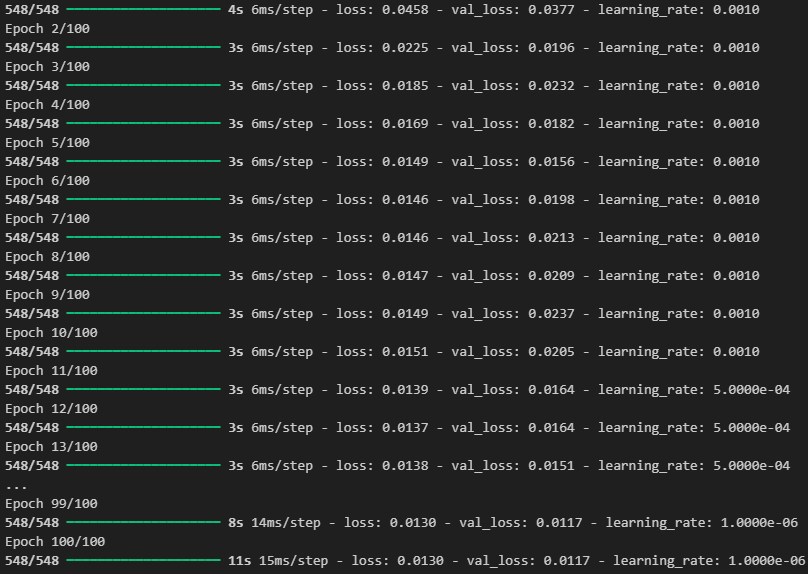
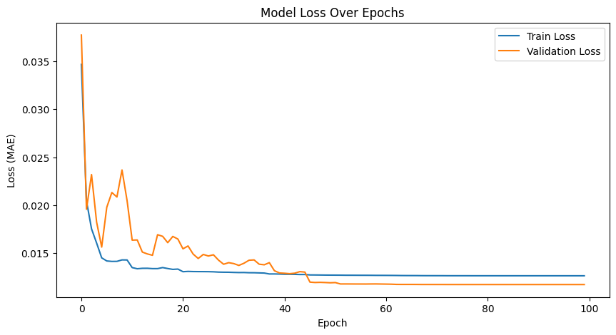
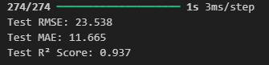
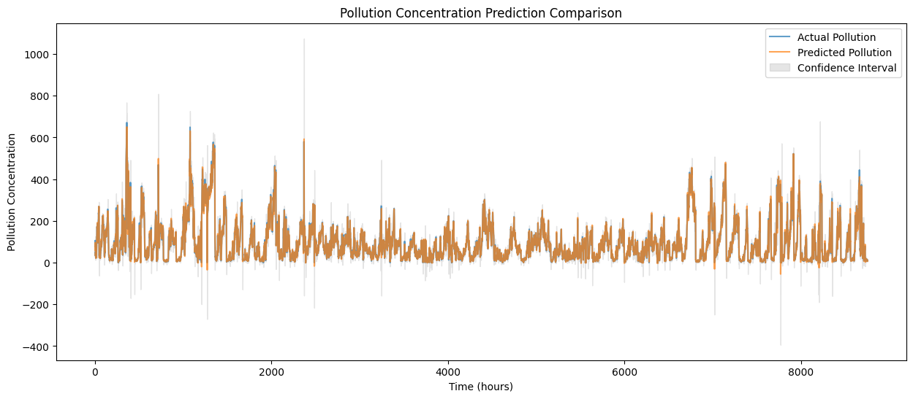
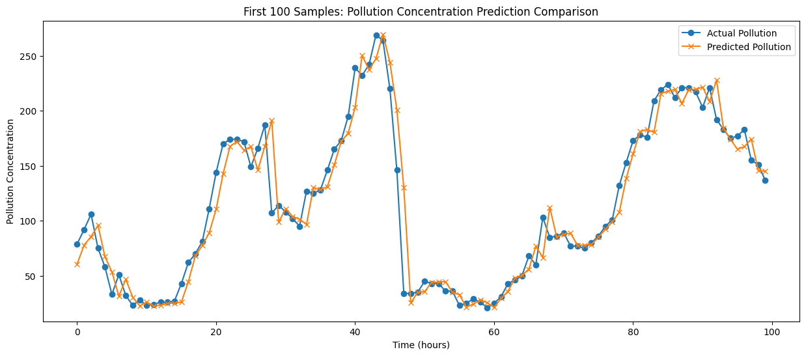

# LSTM作业报告

秦超 22373405

## 摘要

此为PRML第三次作业，旨在用应用LSTM模型训练所给数据集，根据之前小时的天气和污染情况，预测下一小时的污染情况。

## 研究方法

此实验应用LSTM架构结合多变量以提高预测准确性。

### 多变量LSTM模型

LSTM（Long Short-Term Memory，长短期记忆网络）是一种特殊的循环神经网络（RNN）架构，主要用于处理序列数据，能够有效地解决传统 RNN 在处理长序列时的梯度消失和梯度爆炸问题。

多变量 LSTM 是 LSTM 的一种扩展形式，用于处理包含多个特征变量的时间序列数据。在传统的单变量 LSTM 中，每个时间步只有一个特征变量作为输入，而在多变量 LSTM 中，每个时间步可以有多个特征变量作为输入。例如，在气象预测中，可以将温度、湿度、风速等多个气象数据作为输入特征。

## 实验内容

给出一个报告了五年内每小时的天气情况和污染水平的数据集。数据包括日期时间、名为PM2.5浓度的污染情况，以及天气信息，包括露点、温度、气压、风向、风速以及雪和雨的累计小时数。利用这些数据构建一个预测问题，即根据之前的小时的天气条件和污染情况，预测下一个小时的污染水平。

在python中，使用多变量LSTM模型实现。

```python
# 构建LSTM模型
model = Sequential()
model.add(LSTM(50, input_shape=(train_X.shape[1], train_X.shape[2])))
model.add(Dense(1))
model.compile(loss='mae', optimizer='adam'）
```

利用早停法和动态学习率调整进行优化，最后进行模型训练。

```python
# 早停法和动态学习率调整
early_stopping = EarlyStopping(monitor='val_loss', 
patience=15, restore_best_weights=True)
reduce_lr = ReduceLROnPlateau(monitor='val_loss', factor=0.5, 
patience=5, min_lr=1e-6)

# 训练模型
history = model.fit(train_X, train_y, epochs=100, batch_size=64, 
                    validation_data=(test_X, test_y), 
                    callbacks=[early_stopping, reduce_lr], 
                    verbose=1, shuffle=False)
```

## 实验数据

通过100批次训练得到最优模型，其中部分批次训练节果如图：



所有训练批次的训练集和验证集损失：



测试集结果：



预测结果（所有预测以及前100个预测）：





## 分析与结论

由测试集结果以及所得预测图像可得，此模型的预测准确性较好。

同时，此模型仍有优化空间，比如早停法并未触发，此可以通过更改耐心值或者调整模型参数来优化。
